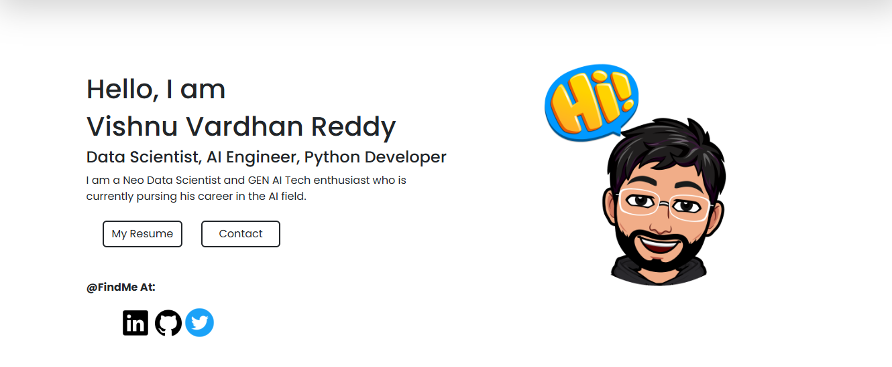

<h1 align="center">Hi 👋, I'm Vishnu Vardhan You can Call me</h1>

<b>A Web Developer, AI Engineer And Data Science Enthusiast</b>

***

- 🔭 I’m currently pursing B.Tech in **Sreenidhi Institute Of Science And Technology**

- 🌱 I’m currently learning **Gen AI, Deep Learning, Web Development, DSA(advanced)**

- 👯 I’m looking to collaborate on **projects in the field of Datascience, artificial intelligence, machine learning**

- 💬 Ask me about **Python, Java, C/C++, R, Canva, Frontend.**

- 📫 How to reach me **vishnureddy228@gmail.com**

- ⚡ Fun fact **I am a professional chess player**

# 💻 Tech Stack:
                     
  

## 🎓Certifications
  <em>certified for</em> -- Data Science For Engineers 
 <em>certified for</em> -- Fundamentals Of UX Design 
 <em>certified for</em> -- Data Scientist Professional with Python 
 <em>certified by</em> -- UC Sandiego 
 <em>certified by</em> -- Google 
 <em>certified by</em> -- AWS 
 <em>certified by</em> -- AWS
 

  
 <h2>🌐My Portfolio</h2> 

  

 
  
<h2>📊 Stats and Activity</h2>

  

 
<h3 align="center">Connect with me:</h3>

  

  

